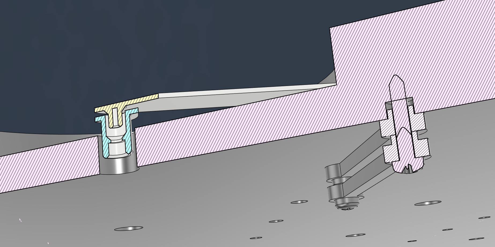

# clockclock24-replica
DISCLAIMER: All files in this repository are intended for personal use only. All design rights go to Humans Since 1982.

Simple mechanical design for a clockclock24 wall clock compatible with the PCB design by [Vallasc](https://github.com/Vallasc), available here: [clockclock24-replica](https://github.com/Vallasc/clockclock24-replica)  

[3D Preview](clockclock24%20body%20(preview).stl)

## Body
The body is CNC-Milled from a 900x400mm board of 19mm MDF. A frame for wall-mounting and LED ambient lighting is constructed from the same 19mm MDF, cut into different-length strips. The frame is assembled and attached using regular wood glue. 

## PCB attachment
The assembled PCBs are attached using 4 identical 3D-printed spacers each, designed for an ST (self-tapping) 2.9 x 16 metric screw. When using the specified screw, the spacers will self-align the PCBs to the wooden body. 

## Clock arms
The clock arms are 3D-printed and designed to press-fit onto the motor shaft. Slight adjustments to the bore size may be needed to adjust for 3D-printer tolerances. 

## Parts list
| Qty. | Desc.                                                  | Stock             | Processing               |
|-----:|--------------------------------------------------------|-------------------|--------------------------|
| 1    | Body                                                   | 900x400x19mm MDF  | CNC milling (both sides) |
| 2    | Frame piece (long)                                     | 838x25x19mm MDF   | Wood glue                |
| 2    | Frame piece (short)                                    | 300x25x19mm MDF   | Wood glue                |
| 32   | ST 2.9 x 16 metric screw                               |                   |                          |
| 32   | [Spacer](drawings/clockclock24%20spacer.stl)           | PLA or comparable | 3D-printing              |
| 24   | [Upper hand](drawings/clockclock24%20upper%20hand.stl) | PLA or comparable | 3D-printing              |
| 24   | [Lower hand](drawings/clockclock24%20lower%20hand.stl) | PLA or comparable | 3D-printing              |

## Photos

